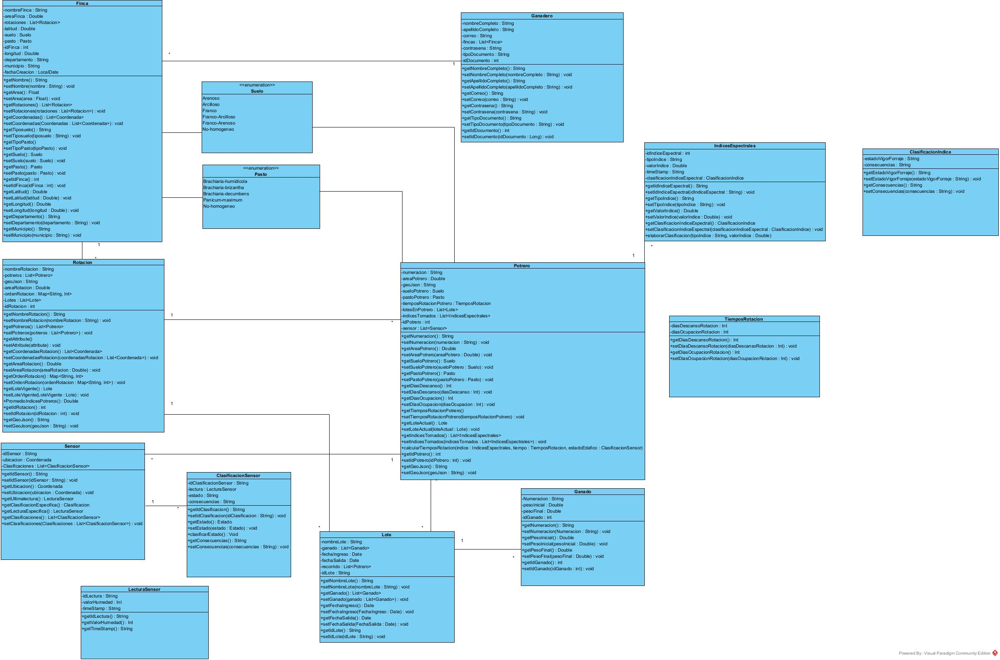
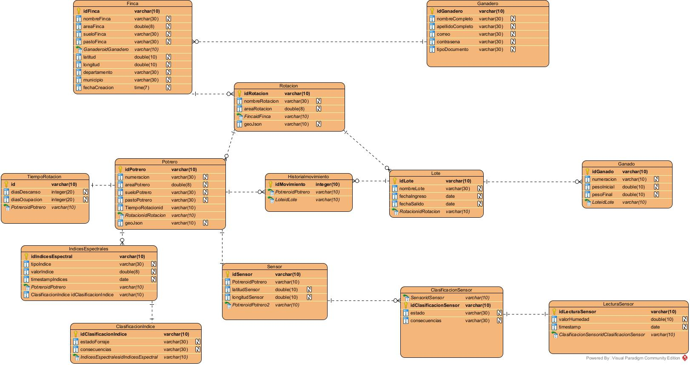

# 🐄 SIMGAN Demo — Sistema de Gestión Ganadera

Demo funcional para registrar fincas, dibujar terrenos sobre imagen satelital, calcular áreas, subdividir en parcelas y gestionar rotación de pastoreo.

---

## 📋 Qué hace el Demo

| Paso | Pantalla | Acción |
|------|----------|--------|
| 1 | **Crear Finca** | Registrar nombre, dueño, ubicación GPS |
| 2 | **Crear Terreno** | Dibujar polígono sobre mapa satelital → calcula área automáticamente |
| 3 | **Parcelas** | Subdividir terreno en parcelas → valida que estén dentro del terreno |
| 4 | **Rotación** | Vista de rotación de pastoreo con estados: Disponible / En uso / En descanso |

---

## 🛠️ Tech Stack

**Backend:**
- Java 17 + Spring Boot 3.2
- PostgreSQL
# SIMGAN Demo — Sistema de Gestión Ganadera

Demo funcional de gestión ganadera con mapas satelitales, rotación de pastoreo, análisis NDVI y seguimiento de ganado.

---

## Lo que incluye el proyecto

El sistema fue construido en 7 fases incrementales:

| Fase | Módulo | Descripción |
|------|--------|-------------|
| 1 | **Fincas** | Registro de fincas con nombre, dueño y coordenadas GPS |
| 2 | **Terrenos** | Dibujar polígonos sobre mapa satelital → calcula área automáticamente |
| 3 | **Parcelas** | Subdividir terrenos en parcelas con validación geoespacial |
| 4 | **Rotación** | Estados de pastoreo por parcela: Disponible / En uso / En descanso |
| 5 | **UI / Dashboard** | Sidebar, componentes reutilizables, diseño mobile-first, dashboard por finca |
| 6 | **Lotes y Ganado** | Grupos de animales con peso, tipo, asignación a parcelas e historial de movimiento |
| 7 | **NDVI / Análisis** | Análisis de vegetación con Sentinel-2 y Planet Labs, alertas automáticas, recomendaciones de rotación |

---

## Tech Stack

**Backend:**
- Java 17 + Spring Boot 3.2
- PostgreSQL 16
- Spring Data JPA + Hibernate
- Lombok

**Frontend:**
- React 18 + Vite
- React Leaflet (mapa interactivo)
- Esri World Imagery (tiles satelitales)
- Leaflet Draw (dibujo de polígonos)
- Turf.js (cálculo de áreas geoespaciales)
- React Router v6
- Axios
- React Hot Toast

---

## 🚀 Setup Paso a Paso

### 1. PostgreSQL

```bash
# Crear la base de datos
psql -U postgres -c "CREATE DATABASE simgan_db;"

# (Opcional) Ejecutar el script SQL de referencia
psql -U postgres -d simgan_db -f database/init.sql
```

> **Nota:** Spring Boot crea las tablas automáticamente con `ddl-auto=update`. El script SQL es solo de referencia.

### 2. Backend (IntelliJ)

1. Abre la carpeta `backend/` como proyecto Maven en IntelliJ
2. IntelliJ detectará el `pom.xml` → importa dependencias
3. Las credenciales locales por defecto en `src/main/resources/application.properties`
   ya coinciden con las del `docker-compose.yml`:
   ```properties
   spring.datasource.url=jdbc:postgresql://localhost:5432/simgan_db
   spring.datasource.username=simgan
   spring.datasource.password=simgan123
   ```
   No necesitas crear ningún `.env` para correr localmente. El envío de correo
   está **desactivado por defecto** en local (`MAIL_ENABLED=false`); para
   probarlo ver `backend/.env.example`.
4. Ejecuta `SimganDemoApplication.java` (clic derecho → Run)
5. El backend corre en `http://localhost:8080`

### 3. Frontend

```bash
cd frontend
- React Leaflet + Esri World Imagery (mapa satelital)
- Leaflet Draw (dibujo de polígonos)
- Turf.js (cálculos geoespaciales)
- Recharts (graficas NDVI)
- React Router v6 + Axios

---

## Requisitos previos

- Java 17+
- Node.js 18+
- Docker y Docker Compose (recomendado para PostgreSQL), o PostgreSQL 16 instalado localmente
- Maven (o usar el wrapper `./mvnw` incluido)

---

## Levantar el proyecto

### Opción A: Docker para PostgreSQL (recomendado)

```bash
# 1. Levantar la base de datos
docker-compose up -d

# 2. Verificar que postgres está corriendo
docker ps
```

### Opción B: PostgreSQL local

```bash
psql -U postgres -c "CREATE DATABASE simgan_db;"
```

---

### Backend

```bash
cd backend

# Compilar y correr
./mvnw spring-boot:run
```

O desde IntelliJ:
1. Abrir la carpeta `backend/` como proyecto Maven
2. Verificar credenciales en `src/main/resources/application.properties`
3. Ejecutar `SimganDemoApplication.java`

El backend corre en `http://localhost:8080`.

> Al iniciar, Spring Boot crea las tablas automáticamente (`ddl-auto=update`) y genera datos NDVI de demostración para los últimos 6 meses (`ndvi.seed.enabled=true`).

---

### Frontend

```bash
cd frontend

npm install
npm run dev
```

Abre `http://localhost:5173` en el navegador.

> El proxy de Vite redirige `/api/*` al backend automáticamente.

---

## 📡 API Endpoints
## Configuración

El archivo `backend/src/main/resources/application.properties` contiene:

```properties
# Base de datos
spring.datasource.url=jdbc:postgresql://localhost:5432/simgan_db
spring.datasource.username=postgres
spring.datasource.password=postgres

# Planet Labs API (opcional — para imágenes satelitales reales)
planet.api.key=TU_API_KEY

# Copernicus / Sentinel-2 (opcional — para análisis NDVI real)
copernicus.username=TU_EMAIL
copernicus.password=TU_PASSWORD

# NDVI seed data (genera datos demo al iniciar)
ndvi.seed.enabled=true
ndvi.seed.months=6
```

Sin las API keys de Planet Labs o Copernicus, el sistema usa datos de demostración generados automáticamente.

---

## Flujo de uso sugerido

1. Ir a **Fincas** → Crear una finca con coordenadas GPS (ej: Montería `8.7479, -75.8814`)
2. Desde el dashboard de la finca → **Nuevo Terreno** → Dibujar polígono sobre el mapa satelital
3. Entrar al terreno → **Parcelas** → Subdividir en 3-4 parcelas
4. **Rotación** → Cambiar estados de pastoreo por parcela
5. **Lotes** → Crear un lote de ganado, agregar animales, asignar a una parcela
6. **NDVI** → Ver dashboard con salud de vegetación, alertas y recomendaciones de rotación

---

## API Endpoints

### Fincas
| Method | URL | Descripción |
|--------|-----|-------------|
| `POST` | `/api/farms` | Crear finca |
| `GET` | `/api/farms` | Listar todas |
| `GET` | `/api/farms/{id}` | Obtener por ID |
| `GET` | `/api/farms` | Listar todas |
| `GET` | `/api/farms/{id}` | Obtener por ID |
| `POST` | `/api/farms` | Crear finca |
| `DELETE` | `/api/farms/{id}` | Eliminar |

### Terrenos
| Method | URL | Descripción |
|--------|-----|-------------|
| `POST` | `/api/terrains` | Crear terreno (con GeoJSON) |
| `GET` | `/api/terrains/farm/{farmId}` | Listar por finca |
| `GET` | `/api/terrains/{id}` | Obtener por ID |
| `GET` | `/api/terrains/farm/{farmId}` | Listar por finca |
| `GET` | `/api/terrains/{id}` | Obtener por ID |
| `POST` | `/api/terrains` | Crear terreno (con GeoJSON) |
| `DELETE` | `/api/terrains/{id}` | Eliminar |

### Parcelas
| Method | URL | Descripción |
|--------|-----|-------------|
| `POST` | `/api/parcels` | Crear parcela |
| `GET` | `/api/parcels/terrain/{terrainId}` | Listar por terreno |
| `PATCH` | `/api/parcels/{id}/status` | Cambiar estado rotación |
| `DELETE` | `/api/parcels/{id}` | Eliminar |

### Ejemplo: Crear Finca
```json
POST /api/farms
{
  "name": "Hacienda Los Robles",
  "owner": "Carlos Rodríguez",
  "department": "Córdoba",
  "municipality": "Montería",
  "centerLat": 8.7479,
  "centerLng": -75.8814
}
```

### Ejemplo: Cambiar Estado Parcela
```json
PATCH /api/parcels/1/status
{
  "status": "EN_USO"
}
```

---

## 🗂️ Estructura del Proyecto

```
simgan-demo/
| `GET` | `/api/parcels/terrain/{terrainId}` | Listar por terreno |
| `POST` | `/api/parcels` | Crear parcela |
| `PATCH` | `/api/parcels/{id}/status` | Cambiar estado de rotación |
| `DELETE` | `/api/parcels/{id}` | Eliminar |

### Lotes y Ganado
| Method | URL | Descripción |
|--------|-----|-------------|
| `GET` | `/api/lotes/terrain/{terrainId}` | Listar lotes por terreno |
| `GET` | `/api/lotes/{id}` | Obtener lote |
| `POST` | `/api/lotes` | Crear lote |
| `PATCH` | `/api/lotes/{id}/close` | Cerrar lote |
| `POST` | `/api/lotes/{id}/assign-parcel` | Asignar parcela al lote |
| `POST` | `/api/lotes/{id}/ganado` | Agregar animal al lote |
| `POST` | `/api/lotes/{id}/ganado/batch` | Agregar animales en lote |
| `PUT` | `/api/lotes/ganado/{ganadoId}` | Actualizar animal |
| `DELETE` | `/api/lotes/ganado/{ganadoId}` | Eliminar animal |

### NDVI / Análisis
| Method | URL | Descripción |
|--------|-----|-------------|
| `GET` | `/api/ndvi/dashboard/{terrainId}` | Dashboard completo con NDVI y biomasa |
| `GET` | `/api/ndvi/timeline/{terrainId}` | Serie temporal de NDVI |
| `GET` | `/api/ndvi/comparison/{terrainId}` | Comparación entre parcelas |
| `GET` | `/api/ndvi/recommendations/{terrainId}` | Recomendaciones de rotación |
| `POST` | `/api/ndvi/analyze/{terrainId}` | Ejecutar análisis |
| `GET` | `/api/ndvi/grazing-estimate/{terrainId}` | Estimación de capacidad de pastoreo |

---

## Estructura del proyecto

```
simgan-demo/
├── docker-compose.yml              # PostgreSQL en Docker
├── database/
│   └── init.sql                    # Script SQL de referencia
├── backend/
│   ├── pom.xml
│   └── src/main/java/com/simgan/
│       ├── SimganDemoApplication.java
│       ├── config/
│       │   ├── CorsConfig.java
│       │   └── GlobalExceptionHandler.java
│       ├── controller/
│       │   ├── FarmController.java
│       │   ├── TerrainController.java
│       │   └── ParcelController.java
│       ├── dto/
│       │   ├── FarmDto.java
│       │   ├── TerrainDto.java
│       │   └── ParcelDto.java
│       ├── entity/
│       │   ├── Farm.java
│       │   ├── Terrain.java
│       │   └── Parcel.java
│       ├── repository/
│       │   ├── FarmRepository.java
│       │   ├── TerrainRepository.java
│       │   └── ParcelRepository.java
│       └── service/
│           ├── FarmService.java
│           ├── TerrainService.java
│           └── ParcelService.java
├── frontend/
│   ├── package.json
│   ├── vite.config.js
│   ├── index.html
│   └── src/
│       ├── main.jsx
│       ├── App.jsx
│       ├── index.css
│       ├── services/api.js
│       └── pages/
│           ├── FarmsPage.jsx
│           ├── CreateFarmPage.jsx
│           ├── CreateTerrainPage.jsx
│           ├── ParcelsPage.jsx
│           └── RotationPage.jsx
└── database/
    └── init.sql
│       │   ├── ParcelController.java
│       │   ├── LoteController.java
│       │   └── NdviController.java
│       ├── entity/
│       │   ├── Farm.java
│       │   ├── Terrain.java
│       │   ├── Parcel.java
│       │   ├── Lote.java
│       │   ├── Ganado.java
│       │   ├── LoteParcelHistory.java
│       │   ├── RotationHistory.java
│       │   ├── NdviRecord.java
│       │   └── NdviCalibration.java
│       ├── service/
│       │   ├── FarmService.java
│       │   ├── TerrainService.java
│       │   ├── ParcelService.java
│       │   ├── LoteService.java
│       │   ├── NdviProcessingService.java
│       │   ├── NdviRecommendationService.java
│       │   ├── NdviSeedService.java
│       │   ├── PlanetApiService.java
│       │   ├── SentinelApiService.java
│       │   └── AnalysisOrchestrator.java
│       ├── dto/
│       ├── repository/
│       └── resources/
│           └── application.properties
└── frontend/
    ├── package.json
    ├── vite.config.js
    └── src/
        ├── App.jsx
        ├── pages/
        │   ├── FarmsPage.jsx
        │   ├── CreateFarmPage.jsx
        │   ├── FarmDashboardPage.jsx
        │   ├── CreateTerrainPage.jsx
        │   ├── ParcelsPage.jsx
        │   ├── RotationPage.jsx
        │   ├── LotesPage.jsx
        │   ├── LoteDetailPage.jsx
        │   └── NdviDashboardPage.jsx
        ├── components/        # Badge, Breadcrumb, Button, Card, Sidebar, etc.
        ├── hooks/             # useFarm, useTerrain, useLote, useNdvi
        ├── services/
        │   └── api.js
        └── utils/
            ├── ndvi.js
            └── grazing.js
```

---

## 🔮 Futuro (No incluido en demo)

> "Estamos planeando integrar **Sentinel-2 (ESA)** como fuente de datos satelitales:
> - Gratuito
> - Multiespectral
> - NDVI-ready
> - Revisita cada 5 días
>
> Esto permitirá análisis automático de salud vegetacional y recomendaciones inteligentes de rotación."

### Funcionalidades planeadas:
- 🛰️ Integración Planet Labs (premium)
- 📊 Análisis NDVI / vegetación espectral
- 🤖 Generación automática de parcelas
- 📈 Dashboard de métricas por parcela
- 🔔 Alertas de rotación

---

## 💡 Tips para la Demo

1. **GPS de ejemplo para Colombia (zona ganadera):**
   - Montería, Córdoba: `8.7479, -75.8814`
   - Sincelejo, Sucre: `9.3047, -75.3978`
   - Villavicencio, Meta: `4.1420, -73.6266`

2. **Flujo de demo sugerido:**
   - Crear finca → Dibujar terreno sobre satélite → Crear 3 parcelas → Ir a vista de rotación → Alternar estados

3. **El mapa usa Esri World Imagery** (gratuito, no necesita API key)


## Despliegue

Ver [`DEPLOYMENT.md`](DEPLOYMENT.md) para la guía completa de despliegue en
**Railway** (backend + Postgres) y **Vercel** (frontend).

---

## Diagrama de clase v4 

  


## Diagrama de ER v2
 

## GPS de ejemplo (Colombia — zonas ganaderas)

| Municipio | Lat | Lng |
|-----------|-----|-----|
| Montería, Córdoba | `8.7479` | `-75.8814` |
| Sincelejo, Sucre | `9.3047` | `-75.3978` |
| Villavicencio, Meta | `4.1420` | `-73.6266` |
| Yopal, Casanare | `5.3378` | `-72.3959` |
